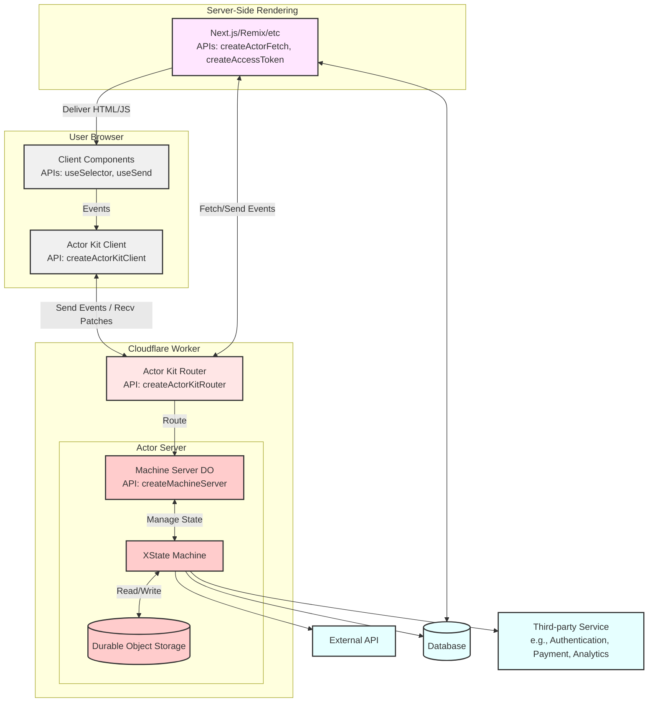

# 🎭 Actor Kit

Actor Kit is a library for running state machines in Cloudflare Workers, leveraging XState for robust state management. It provides a framework for managing the logic, lifecycle, persistence, synchronization, and access control of actors in a distributed environment.

## 📚 Table of Contents

- [💾 Installation](#-installation)
- [🏗️ Architecture](#️-architecture)
- [🌟 Key Concepts](#-key-concepts)
- [🛠️ Usage](#️-usage)
  - [1️⃣ Define your event schemas and types](#1️⃣-define-your-event-schemas-and-types)
  - [2️⃣ Define your state machine](#2️⃣-define-your-state-machine)
  - [3️⃣ Set up the Actor Server](#3️⃣-set-up-the-actor-server)
  - [4️⃣ Configure Wrangler](#4️⃣-configure-wrangler)
  - [5️⃣ Create a Cloudflare Worker with Actor Kit Router](#5️⃣-create-a-cloudflare-worker-with-actor-kit-router)
  - [6️⃣ Create the Actor Kit Context](#6️⃣-create-the-actor-kit-context)
  - [7️⃣ Fetch data server-side](#7️⃣-fetch-data-server-side)
  - [8️⃣ Create a client-side component](#8️⃣-create-a-client-side-component)
- [🚀 Getting Started](#-getting-started)
- [🗂️ Framework Examples](#️-framework-examples)
  - [⚛️ Next.js](/examples/nextjs-actorkit-todo/README.md)
  - [🎸 Remix](/examples/remix-actorkit-todo/README.md)
- [📖 API Reference](#-api-reference)
  - [🔧 actor-kit/worker](#-actor-kitworker)
  - [🖥️ actor-kit/server](#️-actor-kitserver)
  - [🌐 actor-kit/browser](#-actor-kitbrowser)
  - [⚛️ actor-kit/react](#️-actor-kitreact)
- [🔑 TypeScript Types](#-typescript-types)
- [👥 Caller Types](#-caller-types)
- [🔐 Public and Private Data](#-public-and-private-data)
- [📜 License](#-license)
- [🔗 Related Technologies and Inspiration](#-related-technologies-and-inspiration)
- [🚧 Development Status](#-development-status)

## 💾 Installation

To install Actor Kit, use your preferred package manager:

```bash
npm install actor-kit xstate zod
# or
yarn add actor-kit xstate zod
# or
pnpm add actor-kit xstate zod
```

## 🌟 Key Concepts

- 🖥️ **Server-Side Rendering**: Fetch initial state server-side for optimal performance and SEO.
- ⚡ **Real-time Updates**: Changes are immediately reflected across all connected clients, ensuring a responsive user experience.
- 🛡️ **Type Safety**: Leverage TypeScript and Zod for robust type checking and runtime validation.
- 🎭 **Event-Driven Architecture**: All state changes are driven by events, providing a clear and predictable data flow.
- 🧠 **State Machine Logic**: Powered by XState, making complex state management more manageable and visualizable.
- 🔄 **Seamless Synchronization**: Actor Kit handles state synchronization between server and clients automatically.
- 🔐 **Public and Private Data**: Manage shared data across all clients and caller-specific information securely.
- 🌐 **Distributed Systems**: Built for scalable, distributed applications running on edge computing platforms.

## 🏗️ Architecture



## 🛠️ Usage

Here's a comprehensive example of how to use Actor Kit to create a todo list application with Next.js and Cloudflare Workers:

### 1️⃣ Define your event schemas and types

First, define the schemas and types for your events:

```typescript
// src/todo.schemas.ts
import { z } from "zod";

export const TodoClientEventSchema = z.discriminatedUnion("type", [
  z.object({
    type: z.literal("ADD_TODO"),
    text: z.string(),
  }),
  z.object({
    type: z.literal("TOGGLE_TODO"),
    id: z.string(),
  }),
  z.object({
    type: z.literal("DELETE_TODO"),
    id: z.string(),
  }),
]);

export const TodoServiceEventSchema = z.discriminatedUnion("type", [
  z.object({
    type: z.literal("SYNC_TODOS"),
    todos: z.array(
      z.object({ id: z.string(), text: z.string(), completed: z.boolean() })
    ),
  }),
]);

// src/todo.types.ts
import type { WithActorKitEvent, ActorKitSystemEvent } from "actor-kit";
import { z } from "zod";
import { TodoClientEventSchema, TodoServiceEventSchema } from "./todo.schemas";

export type TodoClientEvent = z.infer<typeof TodoClientEventSchema>;
export type TodoServiceEvent = z.infer<typeof TodoServiceEventSchema>;

export type TodoEvent =
  | WithActorKitEvent<TodoClientEvent, "client">
  | WithActorKitEvent<TodoServiceEvent, "service">
  | ActorKitSystemEvent;
```

### 2️⃣ Define your state machine

Now that we have our event types defined, we can create our state machine:

```typescript
// src/todo.machine.ts
import type { CreateMachineProps } from "actor-kit";
import { assign, setup } from "xstate";
import type { TodoEvent } from "./todo.types";

export const createTodoListMachine = ({ id, caller }: CreateMachineProps) =>
  setup({
    types: {
      context: {} as {
        public: {
          ownerId: string;
          todos: Array<{ id: string; text: string; completed: boolean }>;
          lastSync: number | null;
        };
        private: Record<string, { lastAccessTime?: number }>;
      },
      events: {} as TodoEvent,
    },
    actions: {
      addTodo: assign({
        public: ({ context, event }) => {
          if (event.type !== "ADD_TODO") return context.public;
          return {
            ...context.public,
            todos: [
              ...context.public.todos,
              { id: crypto.randomUUID(), text: event.text, completed: false },
            ],
            lastSync: Date.now(),
          };
        },
      }),
      // ... other actions ...
    },
    guards: {
      // ... guards ...
    },
  }).createMachine({
    id: "todoList",
    initial: "idle",
    context: {
      public: {
        ownerId: caller.id,
        todos: [],
        lastSync: null,
      },
      private: {},
    },
    states: {
      idle: {
        on: {
          ADD_TODO: {
            actions: "addTodo",
          },
          // ... other transitions ...
        },
      },
      // ... other states ...
    },
  });
```

### 3️⃣ Set up the Actor Server

Create the Actor Server using the `createMachineServer` function:

```typescript
// src/todo.server.ts
import { createMachineServer } from "actor-kit/worker";
import { createTodoListMachine } from "./todo.machine";
import { TodoClientEventSchema, TodoServiceEventSchema } from "./todo.schemas";

export const Todo = createMachineServer({
  createMachine: createTodoListMachine,
  eventSchemas: {
    client: TodoClientEventSchema,
    service: TodoServiceEventSchema,
  },
  options: {
    persisted: true,
  },
});

export type TodoServer = InstanceType<typeof Todo>;
export default Todo;
```

### 4️⃣ Configure Wrangler

Create a `wrangler.toml` file in your project root:

```toml
name = "nextjs-actorkit-todo"
main = "src/server.ts"
compatibility_date = "2024-09-25"

[vars]
ACTOR_KIT_SECRET = "foobarbaz"

[[durable_objects.bindings]]
name = "TODO"
class_name = "Todo"

[[migrations]]
tag = "v1"
new_classes = ["Todo"]
```

### 5️⃣ Create a Cloudflare Worker with Actor Kit Router

Create a new file, e.g., `src/server.ts`, to set up your Cloudflare Worker:

```typescript
// src/server.ts
import { DurableObjectNamespace } from "@cloudflare/workers-types";
import { AnyActorServer } from "actor-kit";
import { createActorKitRouter } from "actor-kit/worker";
import { WorkerEntrypoint } from "cloudflare:workers";
import { Todo, TodoServer } from "./todo.server";

interface Env {
  TODO: DurableObjectNamespace<TodoServer>;
  ACTOR_KIT_SECRET: string;
  [key: string]: DurableObjectNamespace<AnyActorServer> | unknown;
}

const router = createActorKitRouter<Env>(["todo"]);

export { Todo };

export default class Worker extends WorkerEntrypoint<Env> {
  fetch(request: Request): Promise<Response> | Response {
    if (request.url.includes("/api/")) {
      return router(request, this.env, this.ctx);
    }

    return new Response("API powered by ActorKit");
  }
}
```

### 6️⃣ Create the Actor Kit Context

```typescript
// src/todo.context.tsx
"use client";

import type { TodoMachine } from "./todo.machine";
import { createActorKitContext } from "actor-kit/react";

export const TodoActorKitContext = createActorKitContext<TodoMachine>("todo");
export const TodoActorKitProvider = TodoActorKitContext.Provider;
```

### 7️⃣ Fetch data server-side

```typescript
// src/app/lists/[id]/page.tsx
import { getUserId } from "@/session";
import { createAccessToken, createActorFetch } from "actor-kit/server";
import { TodoActorKitProvider } from "./todo.context";
import type { TodoMachine } from "./todo.machine";
import { TodoList } from "./components";

const host = process.env.ACTOR_KIT_HOST!;
const signingKey = process.env.ACTOR_KIT_SECRET!;

const fetchTodoActor = createActorFetch<TodoMachine>({
  actorType: "todo",
  host,
});

export default async function TodoPage(props: { params: { id: string } }) {
  const listId = props.params.id;
  const userId = await getUserId();

  const accessToken = await createAccessToken({
    signingKey,
    actorId: listId,
    actorType: "todo",
    callerId: userId,
    callerType: "client",
  });

  const payload = await fetchTodoActor({
    actorId: listId,
    accessToken,
  });

  return (
    <TodoActorKitProvider
      host={host}
      actorId={listId}
      accessToken={accessToken}
      checksum={payload.checksum}
      initialSnapshot={payload.snapshot}
    >
      <TodoList />
    </TodoActorKitProvider>
  );
}
```

### 8️⃣ Create a client-side component

```typescript
// src/app/lists/[id]/components.tsx
"use client";

import React, { useState } from "react";
import { TodoActorKitContext } from "./todo.context";

export function TodoList() {
  const todos = TodoActorKitContext.useSelector((state) => state.public.todos);
  const send = TodoActorKitContext.useSend();
  const [newTodoText, setNewTodoText] = useState("");

  const handleAddTodo = (e: React.FormEvent) => {
    e.preventDefault();
    if (newTodoText.trim()) {
      send({ type: "ADD_TODO", text: newTodoText.trim() });
      setNewTodoText("");
    }
  };

  return (
    <div>
      <h1>Todo List</h1>
      <form onSubmit={handleAddTodo}>
        <input
          type="text"
          value={newTodoText}
          onChange={(e) => setNewTodoText(e.target.value)}
          placeholder="Add a new todo"
        />
        <button type="submit">Add</button>
      </form>
      <ul>
        {todos.map((todo) => (
          <li key={todo.id}>
            <span
              style={{
                textDecoration: todo.completed ? "line-through" : "none",
              }}
            >
              {todo.text}
            </span>
            <button onClick={() => send({ type: "TOGGLE_TODO", id: todo.id })}>
              {todo.completed ? "Undo" : "Complete"}
            </button>
            <button onClick={() => send({ type: "DELETE_TODO", id: todo.id })}>
              Delete
            </button>
          </li>
        ))}
      </ul>
    </div>
  );
}
```

This example demonstrates how to set up and use Actor Kit in a Next.js application with Cloudflare Workers, including:

1. Defining event schemas and types
2. Creating the state machine with proper typing
3. Setting up the Actor Server
4. Configuring Wrangler for Cloudflare Workers
5. Creating a Cloudflare Worker with Actor Kit Router
6. Setting up the Actor Kit context
7. Fetching data server-side with access token creation
8. Creating a client-side component that interacts with the actor

## 🚀 Getting Started

1. Install dependencies:

   ```bash
   npm install actor-kit xstate zod
   npm install -D wrangler
   ```

2. Set up environment variables:

   For development:
   Create a `.dev.vars` file in your project root:

   ```bash
   touch .dev.vars
   ```

   Add the following to `.dev.vars`:

   ```
   ACTOR_KIT_SECRET=your-secret-key
   ```

   Replace `your-secret-key` with a secure, randomly generated secret.

   For production:
   Set up the secret using Wrangler:

   ```bash
   npx wrangler secret put ACTOR_KIT_SECRET
   ```

   Enter the same secret key you used in your `.dev.vars` file.

3. Create a `wrangler.toml` file in your project root:

   ```toml
   name = "your-project-name"
   main = "src/server.ts"
   compatibility_date = "2024-09-25"

   [[durable_objects.bindings]]
   name = "YOUR_ACTOR"
   class_name = "YourActor"

   [[migrations]]
   tag = "v1"
   new_classes = ["YourActor"]
   ```

   Replace `your-project-name` with your project's name, and `YOUR_ACTOR` and `YourActor` with your specific actor names.

4. Create your Worker script (e.g., `src/server.ts`):

   ```typescript
   import { createActorKitRouter } from "actor-kit/worker";
   import { YourActor } from "./your-actor.server";

   const actorKitRouter = createActorKitRouter({
     yourActor: YourActor,
   });

   export default {
     async fetch(
       request: Request,
       env: Env,
       ctx: ExecutionContext
     ): Promise<Response> {
       const url = new URL(request.url);

       if (url.pathname.startsWith("/api/")) {
         return actorKitRouter(request, env, ctx);
       }

       return new Response("Server powered by ActorKit");
     },
   };
   ```

5. Start the Cloudflare Worker development server:

   ```bash
   npx wrangler dev
   ```

6. Deploy your Worker to Cloudflare:

   ```bash
   npx wrangler deploy
   ```

7. If you're using Next.js or another external server, set up your `ACTOR_KIT_HOST` environment variable to point to your deployed Worker's URL.

By following these steps, you'll have a basic Actor Kit setup running on Cloudflare Workers. For more detailed, framework-specific instructions, please refer to our example projects for [Next.js](/examples/nextjs-actorkit-todo/README.md) and [Remix](/examples/remix-actorkit-todo/README.md).

## 🗂️ Framework Examples

Actor Kit includes example todo list applications demonstrating integration with popular web frameworks.

- [Next.js example](/examples/nextjs-actorkit-todo/README.md) in `/examples/nextjs-actorkit-todo`

  - Live demo: [https://nextjs-actorkit-todo.vercel.app/](https://nextjs-actorkit-todo.vercel.app/)

- [Remix example](/examples/remix-actorkit-todo/README.md) in `/examples/remix-actorkit-todo`
  - Live demo: [https://remix-actorkit-todo.jonathanrmumm.workers.dev/](https://remix-actorkit-todo.jonathanrmumm.workers.dev/)

These examples showcase how to integrate Actor Kit with different frameworks, demonstrating real-time, event-driven todo lists with owner-based access control. Visit the live demos to see Actor Kit in action!

## 📖 API Reference

### 🔧 `actor-kit/worker`

#### `createMachineServer<TMachine, TEventSchemas, Env>({ createMachine, eventSchemas, options })`

Creates an actor server to run on a Cloudflare Worker.

- `TMachine`: Type parameter extending `ActorKitStateMachine`
- `TEventSchemas`: Type parameter extending `EventSchemas`
- `Env`: Type parameter extending `{ ACTOR_KIT_SECRET: string }`

Parameters:

- `createMachine`: Function that creates the state machine. It receives the following props:
  ```typescript
  {
    id: string;
    caller: Caller;
  }
  ```
- `eventSchemas`: Object containing Zod schemas for different event types.
  - `client`: Schema for events from clients
  - `service`: Schema for events from services
- `options`: (Optional) Additional options for the server.
  - `persisted`: Whether to persist the actor state (default: false)

Returns a class that extends `DurableObject` and implements `ActorServer<TMachine, TEventSchemas, Env>`.

Example usage:

```typescript
import { createMachineServer } from "actor-kit/worker";
import { z } from "zod";

const TodoServer = createMachineServer({
  createMachine: ({ id, caller }) => createTodoMachine({ id, caller }),
  eventSchemas: {
    client: z.discriminatedUnion("type", [
      z.object({ type: z.literal("ADD_TODO"), text: z.string() }),
      z.object({ type: z.literal("TOGGLE_TODO"), id: z.string() }),
    ]),
    service: z.discriminatedUnion("type", [
      z.object({
        type: z.literal("SYNC_TODOS"),
        todos: z.array(
          z.object({ id: z.string(), text: z.string(), completed: z.boolean() })
        ),
      }),
    ]),
  },
  options: { persisted: true },
});
```

#### `createActorKitRouter<Env>(routes)`

Creates a router for handling Actor Kit requests in a Cloudflare Worker.

- `Env: Type parameter extending `EnvWithDurableObjects`
- `routes`: An array of actor types (as kebab-case strings)

Returns a function `(request: Request, env: Env, ctx: ExecutionContext) => Promise<Response>` that handles Actor Kit routing.

Example usage:

```typescript
import { createActorKitRouter } from "actor-kit/worker";

const actorKitRouter = createActorKitRouter(["todo", "chat"]);

export default {
  async fetch(
    request: Request,
    env: Env,
    ctx: ExecutionContext
  ): Promise<Response> {
    return actorKitRouter(request, env, ctx);
  },
};
```

### 🖥️ `actor-kit/server`

#### `createActorFetch<TMachine>({ actorType, host })`

Creates a function for fetching actor data. Used in a trusted server environment, typically for server-side rendering or initial data fetching.

- `TMachine`: Type parameter extending `ActorKitStateMachine`
- `actorType`: String identifier for the actor type
- `host`: The host URL for the Actor Kit server

Returns a function with the following signature:

```typescript
(
  props: {
    actorId: string;
    accessToken: string;
    input?: Record<string, unknown>;
    waitFor?: string;
  },
  options?: RequestInit
) =>
  Promise<{
    snapshot: CallerSnapshotFrom<TMachine>;
    checksum: string;
  }>;
```

Example usage:

```typescript
import { createActorFetch } from "actor-kit/server";
import type { TodoMachine } from "./todo.machine";

const fetchTodoActor = createActorFetch<TodoMachine>({
  actorType: "todo",
  host: "your-worker.workers.dev",
});

const { snapshot, checksum } = await fetchTodoActor({
  actorId: "todo-123",
  accessToken: "your-access-token",
  waitFor: "TODOS_LOADED",
});
```

#### `createAccessToken({ signingKey, actorId, actorType, callerId, callerType })`

Creates an access token for authenticating with an actor.

Parameters:

- `signingKey`: String used to sign the token
- `actorId`: Unique identifier for the actor
- `actorType`: Type of the actor
- `callerId`: Identifier for the caller
- `callerType`: Type of the caller (e.g., 'client', 'service')

Returns a Promise that resolves to a JWT token string.

Example usage:

```typescript
import { createAccessToken } from "actor-kit/server";

const accessToken = await createAccessToken({
  signingKey: process.env.ACTOR_KIT_SECRET!,
  actorId: "todo-123",
  actorType: "todo",
  callerId: "user-456",
  callerType: "client",
});
```

### 🌐 `actor-kit/browser`

#### `createActorKitClient<TMachine>(props: ActorKitClientProps<TMachine>)`

Creates an Actor Kit client for managing state and communication with the server.

- `TMachine`: Type parameter extending `ActorKitStateMachine`

`ActorKitClientProps<TMachine>` includes:

- `host`: String
- `actorType`: String
- `actorId`: String
- `checksum`: String
- `accessToken`: String
- `initialSnapshot`: `CallerSnapshotFrom<TMachine>`

Returns an `ActorKitClient<TMachine>` object with methods to interact with the actor.

Example usage:

```typescript
import { createActorKitClient } from "actor-kit/browser";
import type { TodoMachine } from "./todo.machine";

const client = createActorKitClient<TodoMachine>({
  host: "your-worker.workers.dev",
  actorType: "todo",
  actorId: "todo-123",
  checksum: "initial-checksum",
  accessToken: "your-access-token",
  initialSnapshot: {
    public: { todos: [] },
    private: {},
    value: "idle",
  },
});

await client.connect();
client.send({ type: "ADD_TODO", text: "Buy milk" });
```

### ⚛️ `actor-kit/react`

#### `createActorKitContext<TMachine>(actorType: string)`

Creates a React context and associated hooks for integrating Actor Kit into a React application.

- `TMachine`: Type parameter extending `ActorKitStateMachine`
- `actorType`: String identifier for the actor type

Returns an object with:

- `Provider`: React component to provide the Actor Kit client to its children
- `useClient()`: Hook to access the Actor Kit client directly
- `useSelector<T>(selector: (snapshot: CallerSnapshotFrom<TMachine>) => T)`: Hook to select and subscribe to specific parts of the state
- `useSend()`: Hook to get a function for sending events to the Actor Kit client

Example usage:

```tsx
import { createActorKitContext } from "actor-kit/react";
import type { TodoMachine } from "./todo.machine";

const TodoActorKitContext = createActorKitContext<TodoMachine>("todo");

function App() {
  return (
    <TodoActorKitContext.Provider
      host="your-worker.workers.dev"
      actorId="todo-123"
      accessToken="your-access-token"
      checksum="initial-checksum"
      initialSnapshot={{
        public: { todos: [] },
        private: {},
        value: "idle",
      }}
    >
      <TodoList />
    </TodoActorKitContext.Provider>
  );
}

function TodoList() {
  const todos = TodoActorKitContext.useSelector((state) => state.public.todos);
  const send = TodoActorKitContext.useSend();

  return (
    <ul>
      {todos.map((todo) => (
        <li key={todo.id}>
          {todo.text}
          <button onClick={() => send({ type: "TOGGLE_TODO", id: todo.id })}>
            Toggle
          </button>
        </li>
      ))}
    </ul>
  );
}
```

### System Events

Actor Kit includes several system events that are automatically handled by the state machine. These events are of type `ActorKitSystemEvent` and include:

- `INITIALIZE`: Fired when an actor is first created.
- `CONNECT`: Fired when a client connects to the actor.
- `DISCONNECT`: Fired when a client disconnects from the actor.
- `RESUME`: Fired when an actor is resumed.
- `MIGRATE`: Fired when an actor needs to migrate its state, including an operations array.

The `ActorKitSystemEvent` type is defined as follows:

```typescript
export type ActorKitSystemEvent = 
  | { type: "INITIALIZE"; caller: { type: "system" id: string } }
  | { type: "CONNECT"; caller: { type: "system"; id: string }; clientId: string }
  | { type: "DISCONNECT"; caller: { type: "system"; id: string }; clientId: string }
  | { type: "RESUME"; caller: { type: "system"; id: string } }
  | { type: "MIGRATE"; caller: { type: "system"; id: string }; operations: any[] };
```

These events can be handled in your state machine definition:

```typescript
createMachine({
  // ... other configuration ...
  states: {
    idle: {
      on: {
        INITIALIZE: {
          actions: "initializeActor",
        },
        CONNECT: {
          actions: "handleClientConnection",
        },
        DISCONNECT: {
          actions: "handleClientDisconnection",
        },
        RESUME: {
          actions: "handleActorResume",
        },
        MIGRATE: {
          actions: "handleActorMigration",
        },
        // ... other transitions ...
      },
    },
    // ... other states ...
  },
});
```

## 👥 Caller Types

Actor Kit supports different types of callers, each with its own level of trust and permissions:

- 👤 `client`: Events from end-users or client applications
- 🤖 `system`: Internal events generated by the actor system (handled internally)
- 🔧 `service`: Events from trusted external services or internal microservices

## 🔑 TypeScript Types

The following key types are exported from the main `actor-kit` package:

### `WithActorKitEvent<TEvent, TCallerType>`

Utility type that wraps an event type with Actor Kit-specific properties. This is crucial for adding caller information and other metadata to your events.

Example usage:

```typescript
import { WithActorKitEvent } from "actor-kit";

type MyClientEvent =
  | { type: "ADD_TODO"; text: string }
  | { type: "TOGGLE_TODO"; id: string };

type MyServiceEvent = {
  type: "SYNC_TODOS";
  todos: Array<{ id: string; text: string; completed: boolean }>;
};

type MyEvent =
  | WithActorKitEvent<MyClientEvent, "client">
  | WithActorKitEvent<MyServiceEvent, "service">
  | ActorKitSystemEvent;
```

### `ActorKitSystemEvent`

Type representing system events that Actor Kit generates internally. These events are automatically included in your machine's event type and are used to handle lifecycle operations.

Key system events:

- `INITIALIZE`: Fired when an actor is first created or resumed from storage.
- `CONNECT`: Fired when a client connects to the actor.
- `DISCONNECT`: Fired when a client disconnects from the actor.

Example usage in a state machine:

```typescript
createMachine({
  // ... other configuration ...
  states: {
    idle: {
      on: {
        INITIALIZE: {
          actions: "initializeActor",
        },
        CONNECT: {
          actions: "handleClientConnection",
        },
        DISCONNECT: {
          actions: "handleClientDisconnection",
        },
        // ... other transitions ...
      },
    },
    // ... other states ...
  },
});
```

### `CallerSnapshotFrom<TMachine>`

Utility type to extract the caller-specific snapshot from a machine type. This is useful when working with the state in your components or actions.

Example usage:

```typescript
import { CallerSnapshotFrom } from "actor-kit";
import { TodoMachine } from "./todo.machine";

type TodoSnapshot = CallerSnapshotFrom<TodoMachine>;

function TodoList({ snapshot }: { snapshot: TodoSnapshot }) {
  return (
    <ul>
      {snapshot.public.todos.map((todo) => (
        <li key={todo.id}>{todo.text}</li>
      ))}
    </ul>
  );
}
```

### Other Types

- `ActorKitStateMachine`: Type definition for an Actor Kit state machine, extending XState's `StateMachine` type.
- `ClientEventFrom<TMachine>`: Utility type to extract client events from an Actor Kit state machine.

By including these types in your Actor Kit implementation, you ensure type safety and proper handling of events and state across your application.

## 🔐 Public and Private Data

Actor Kit supports the concepts of public and private data in the context. This allows you to manage shared data across all clients and caller-specific information securely.

## 📜 License

Actor Kit is [MIT licensed](LICENSE.md).

## 🔗 Related Technologies and Inspiration

Actor Kit builds upon and draws inspiration from several excellent technologies:

- [XState](https://xstate.js.org/): A powerful state management library for JavaScript and TypeScript applications.
- [Cloudflare Workers](https://workers.cloudflare.com/): A serverless platform for building and deploying applications at the edge.
- [Zod](https://zod.dev/): A TypeScript-first schema declaration and validation library.
- [PartyKit](https://www.partykit.io/): An inspiration for Actor Kit, providing real-time multiplayer infrastructure.
- [PartyServer](https://github.com/threepointone/partyserver/tree/main): PartyKit, for workers
- [xstate-migrate](https://github.com/jonmumm/xstate-migrate): A migration library for persisted XState machines, designed to facilitate state machine migrations when updating your XState configurations.

## 🚧 Development Status

Actor Kit is currently in active development and is considered alpha software. It is not yet stable or recommended for production use. Use at your own risk and expect frequent changes.
